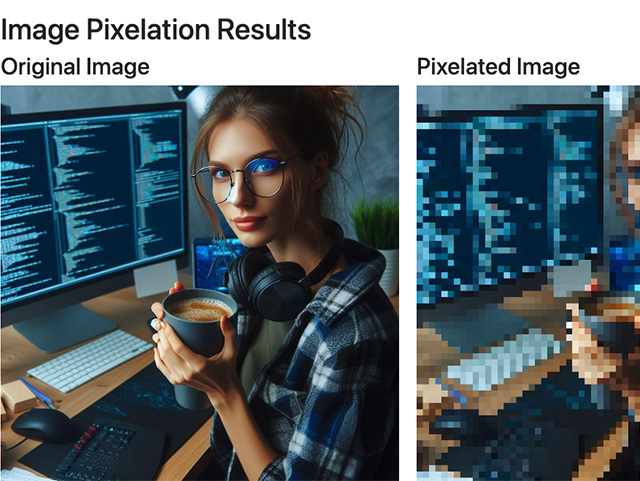

# Pixel Pocus
<div align="center">
  <a href="#">
    
  </a>
</div>
Pixel Pocus is a simple web application that allows users to upload an image and generate a pixelated version of it. The application ensures that no images are saved on a server; all data is processed in memory and deleted after processing.

## Features

- Upload an image and pixelate it with a customizable pixel size.
- View and download the pixelated image.
- Clear and upload new images easily.

## Installation

1. Clone the repository:
   ```bash
   git clone https://github.com/your-username/pixel-pocus.git
   cd pixel-pocus
   pip install -r requirements.txt
   python app.py